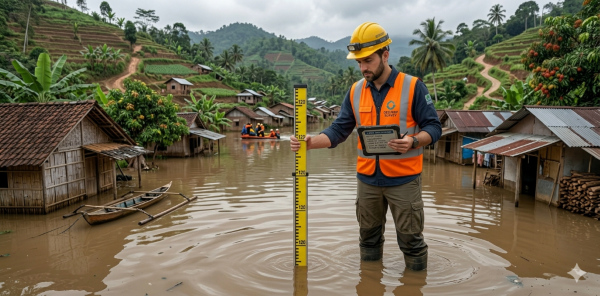
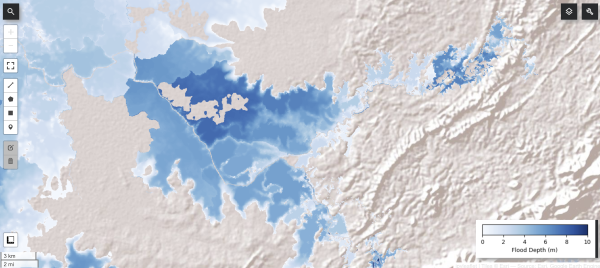
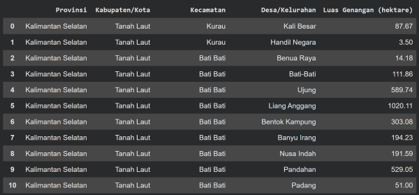

<a target="_blank" href="https://colab.research.google.com/github.com/syamaniulm/hand_flood/blob/main/Hand_Based_Flood_Depth_Modeling.ipynb">
  
</a>

# Estimasi Cepat Sebaran Genangan Banjir

Pernahkah Anda bertanya atau membayangkan? Ketika ada yang mengukur kedalaman genangan banjir pada suatu titik koordinat, sampai dimanakah kira-kira sebaran genangannya? Dan seperti apa sebaran kedalamannya?<br>

<html>
  <body>
    <div>
       
      </a>
    </div>
  </body>
</html>

Dengan mengintegrasikan antara data topografis, yaitu Height Above Nearest Drainage (HAND) dan data koordinat kedalaman genangan banjir lapangan, pertanyaan-pertanyaan seperti di atas dapat terjawab. Secara singkat, dengan menggunakan data koordinat dan kedalaman banjir eksak dari lapangan, kita dapat mengestimasi luas dan sebaran kedalaman genangan banjir.<br>

## Petunjuk Penggunaan

Jalankan file <a href="https://github.com/syamaniulm/hand_flood/blob/main/Hand_Based_Flood_Depth_Modeling.ipynb">```Hand_Based_Flood_Depth_Modeling.ipynb```</a> via Google Colab. Sumber data lapangan harus berisi data koordinat dalam lintang bujur, dan data kedalaman genangan banjir untuk setiap koordinat dalam satuan meter. Data dibuat dalam bentuk tabel dan disimpan dalam format CSV. Karena kode program disiapkan untuk dijalankan menggunakan Google Colab, maka file CSV harus disimpan di dalam Google Drive. Jika kode program dijalankan menggunakan Jupyter Lab atau VS Code, maka harus ada penyesuaian pada beberapa bagian kode. Ikuti format tabel yang dicontohkan pada file <a href="https://github.com/syamaniulm/hand_flood/blob/main/Flood_Locations.csv">```Flood_Locations.csv```</a>.<br>

Di dalam tabel wajib ada kolom ```Long``` yang berisi data bujur dalam decimal degree, ```Lat``` yang berisi data lintang dalam decimal degree, dan ```Depth``` yang berisi data kedalaman banjir dalam satuan meter. Format penulisan huruf besar dan kecil untuk nama-nama kolom ini harus persis sebagaimana contoh. Jika ada perubahan format penulisan, maka harus ada penyesuaian pada beberapa bagian kode.<br>

Data Catchment Area (CA) dan HAND disediakan dalam 6 (enam) opsi berdasarkan ketelitian/luasan (CA), yaitu 5k, 10k, 25k, 50k, 100k, dan 250k. Semakin kecil luasan CA, hasil estimasi akan semakin teliti. Misalnya 25k akan lebih teliti dibanding 50k. Akan tetapi, semakin teliti luasan CA yang digunakan, konsekuensinya akan semakin banyak titik-titik banjir dari lapangan diperlukan. Sebab setiap wilayah CA sekurang-kurangnya terdapat 1 (satu) titik hasil pengukuran kedalaman banjir. Jika suatu CA tidak terdapat titik sampel pengukuran kedalaman banjir, maka sebaran genangan dan kedalaman banjir di dalam CA tersebut tidak dapat diestimasi.

## Konsep Model

Formula yang digunakan untuk estimasi sebaran kedalaman banjir untuk setiap CA adalah:<br>

```FD = FDND - HAND```

Dimana:<br>

FD = Flood Depth, yaitu raster hasil estimasi kedalaman genangan banjir<br>
FDND = Flood Depth from Nearest Drainage, yaitu raster kedalaman banjir yang diukur dari permukaan sungai terdekat<br>
HAND = Raster HAND<br>

Dan:<br>

FDND merupakan hasil rasterisasi untuk setiap CA dari:<br>

```Titik kedalaman banjir hasil pengukuran lapangan + HAND di titik pengukuran tersebut```<br>

Raster ```FDND``` akan memiliki nilai yang seragam (satu nilai) untuk setiap CA. Jika pada suatu CA terdapat lebih dari satu titik pengukuran, maka yang akan diambil adalah satu titik terdalam (maksimum) kedalaman banjir yang diukur dari permukaan sungai terdekat.<br>

### Contoh output:

<html>
  <body>
    <div>
       
      </a>
    </div>
  </body>
</html>

Estimasi sebaran kedalaman genangan banjir<br>

<html>
  <body>
    <div>
       
      </a>
    </div>
  </body>
</html>

Tabel luas genangan banjir untuk setiap desa/kelurahan<br>

### Persyaratan

Anda harus memiliki akun Google Earth Engine untuk menjalankan kode program ini.


### Penafian

Kode program ini merupakan proyek eksperimental. Sehingga masih memerlukan validasi di lapangan.

### Petunjuk Sitasi

Penggunaan HAND di dalam dokumen resmi wajib mengutip literatur ini: <a href="https://www.sciencedirect.com/science/article/abs/pii/S0022169411002599">https://www.sciencedirect.com/science/article/abs/pii/S0022169411002599</a>
