<a target="_blank" href="https://colab.research.google.com/github/syamaniulm/hand_flood/blob/main/Hand_Based_Flood_Depth_Modeling_v2.ipynb">
  
</a>

# Estimasi Cepat Sebaran dan Dampak Banjir

Pernahkah Anda bertanya atau membayangkan? Ketika ada yang mengukur kedalaman genangan banjir pada suatu titik koordinat, sampai dimanakah kira-kira sebaran genangannya? Dan seperti apa sebaran kedalamannya?<br>

<html>
  <body>
    <div>
       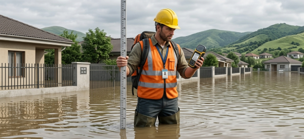<br>
       <figcaption><i>Ilustrasi pengukuran titik koordinat dan kedalaman banjir di lapangan</i></figcaption>
      </a>
    </div>
  </body>
</html>

<br>Dengan mengintegrasikan antara parameter topografis, yaitu Height Above Nearest Drainage (HAND) dan data koordinat kedalaman genangan banjir lapangan, pertanyaan-pertanyaan seperti di atas dapat terjawab.<br>

<html>
  <body>
    <div>
       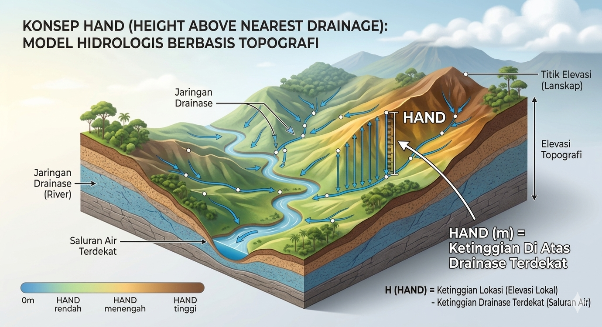<br>
       <figcaption><i>Ilustrasi konsep HAND</i></figcaption>
      </a>
    </div>
  </body>
</html>

<br>HAND merupakan ketinggian suatu titik dari drainase/sungai terdekat. Dengan kata lain, HAND merupakan "elevasi lokal" yang titik nolnya adalah sungai terdekat. HAND biasa digunakan sebagai parameter untuk mengukur kedalaman banjir atau ancaman bahaya banjir akibat luapan air sungai. Secara singkat, dengan menggunakan data HAND, dan sudah tersedia data koordinat dan kedalaman banjir eksak dari lapangan, kita dapat mengestimasi dan memetakan sebaran kedalaman genangan banjir secara cepat pada suatu Catchment Area (CA).<br>

## Konsep Model

Formula yang digunakan untuk estimasi sebaran kedalaman banjir untuk setiap CA adalah sebagai berikut:<br>

$$FD = FDND - HAND$$

Dimana:<br>

$FD$ = Flood Depth, yaitu raster hasil estimasi kedalaman genangan banjir<br>
$FDND$ = Flood Depth from Nearest Drainage, yaitu raster kedalaman banjir yang diukur dari permukaan sungai terdekat<br>
$HAND$ = Raster HAND<br>

Dan:<br>

$FDND$ merupakan hasil rasterisasi untuk setiap CA dari:<br>

$$arg max(GFD + HGFD)$$

Dimana:<br>

$GFD$ = Ground Flood Depth, yaitu data titik koordinat dan kedalaman genangan banjir hasil pengukuran lapangan<br>
$HGFD$ = HAND at Ground Flood Depth, yaitu nilai HAND pada titik koordinat kedalaman genangan banjir<br>

Raster $FDND$ akan memiliki nilai yang seragam (satu nilai) untuk setiap CA. Jika pada suatu CA terdapat lebih dari satu titik pengukuran, maka yang akan diambil adalah satu titik terdalam (maksimum) kedalaman banjir yang diukur dari permukaan sungai terdekat.<br>

## Petunjuk Penggunaan

Jalankan file <a href="https://github.com/syamaniulm/hand_flood/blob/main/Hand_Based_Flood_Depth_Modeling_v2.ipynb">```Hand_Based_Flood_Depth_Modeling_v2.ipynb```</a> via Google Colab. Sumber data lapangan harus berisi data koordinat dalam lintang bujur, dan data kedalaman genangan banjir untuk setiap koordinat dalam satuan meter. Data dibuat dalam bentuk tabel dan disimpan dalam format CSV. Karena kode program disiapkan untuk dijalankan menggunakan Google Colab, maka file CSV harus disimpan di dalam Google Drive. Jika kode program dijalankan menggunakan Jupyter Lab atau VS Code, maka harus ada penyesuaian pada beberapa bagian kode. Ikuti format tabel yang dicontohkan pada file <a href="https://github.com/syamaniulm/hand_flood/blob/main/Flood_Locations.csv">```Flood_Locations.csv```</a>.<br>

Di dalam tabel wajib ada kolom ```Long``` yang berisi data bujur dalam decimal degree, ```Lat``` yang berisi data lintang dalam decimal degree, dan ```Depth``` yang berisi data kedalaman banjir dalam satuan meter. Format penulisan huruf besar dan kecil untuk nama-nama kolom ini harus persis sebagaimana contoh. Jika ada perubahan format penulisan, maka harus ada penyesuaian pada beberapa bagian kode.<br>

Data CA dan HAND disediakan dalam 6 (enam) opsi berdasarkan ukuran/luasan CA, yaitu 5k, 10k, 25k, 50k, 100k, dan 250k. Harap diperhatikan bahwa unit 5k, 25k, 50k, dan seterusnya, bukan lah skala pemetaan. Melainkan luasan atau jumlah pixel minimum untuk CA terkecil. 5k berarti luasan minimum CA adalah 5.000 pixel, mengacu pada pixel data Digital Elevation Model (DEM) yang dijadikan sebagai input.<br>

<html>
  <body>
    <div>
       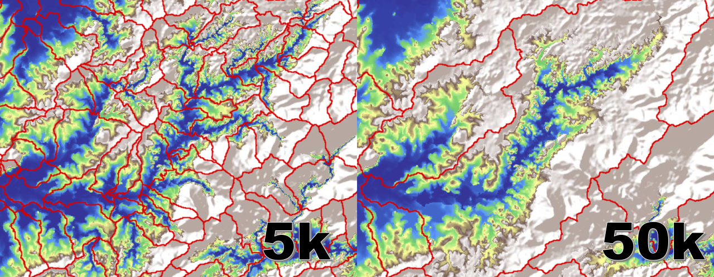<br>
       <figcaption><i>Contoh ukuran Catchment Area (CA) 5k dan 50k</i></figcaption>
      </a>
    </div>
  </body>
</html>

<br>

Ukuran CA yang lebih kecil, misalnya 5k, akan menghasilkan estimasi yang lebih akurat dan lebih teliti. Akan tetapi, menuntut lebih banyak titik sampel kedalaman banjir dari lapangan. Sebab setiap wilayah CA yang tergenang banjir wajib sekurang-kurangnya terdapat 1 (satu) titik hasil pengukuran kedalaman banjir. Jika suatu CA tidak terdapat titik sampel pengukuran kedalaman banjir, maka sebaran genangan dan kedalaman banjir di dalam CA tersebut tidak dapat diestimasi.

Ukuran CA yang lebih besar, misalnya 250k, akan menghasilkan estimasi yang kurang akurat dan kurang teliti, bahkan berpotensi akan over estimate. Akan tetapi, ukuran CA yang lebih besar mampu mengatasi kekurangan titik sampel kedalaman banjir dari lapangan. Bahkan dengan hanya 1 (satu) titik sampel kedalaman banjir untuk wilayah yang cukup luas. Pada praktiknya, pemilihan ukuran CA akan sangat ditentukan oleh informasi kondisi banjir di lapangan, misalnya genangan banjir tersebar sampai desa mana saja.<br>

### Contoh Output Estimasi Sebaran Genangan Banjir

<html>
  <body>
    <div>
       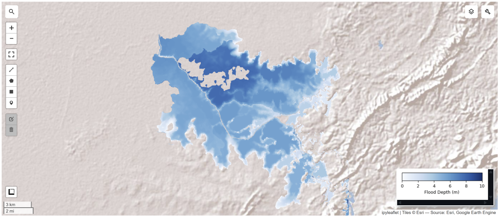<br>
       <figcaption><i>Estimasi sebaran kedalaman genangan banjir</i></figcaption>
      </a>
    </div>
  </body>
</html>

<br>

<html>
  <body>
    <div>
       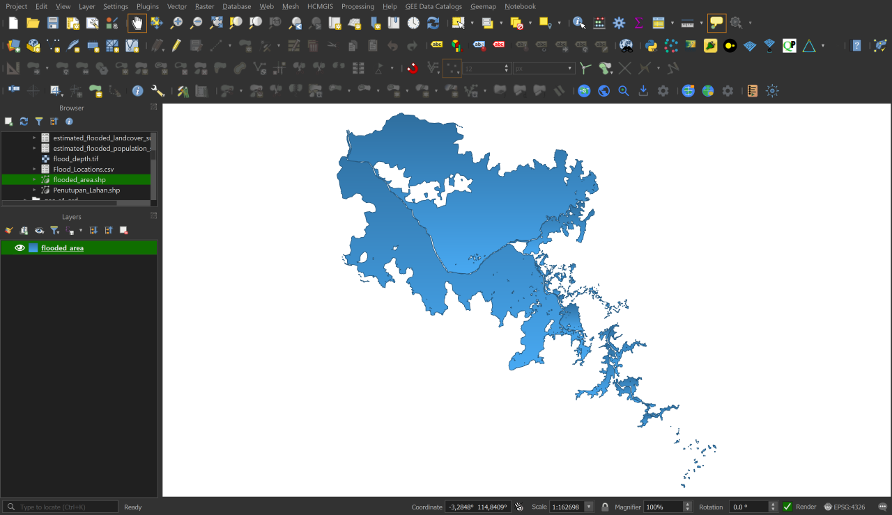<br>
       <figcaption><i>Poligon (shapefile) estimasi area tergenang banjir</i></figcaption>
      </a>
    </div>
  </body>
</html>

<br>

<html>
  <body>
    <div>
       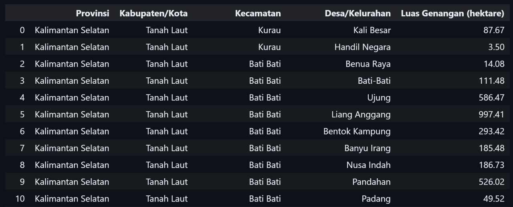<br>
       <figcaption><i>Tabel estimasi luas genangan banjir untuk setiap desa/kelurahan</i></figcaption>
      </a>
    </div>
  </body>
</html>

<br>

Selain estimasi sebaran genangan banjir, kode program yang dikembangkan juga dapat mengestimasi dampak banjir. Yaitu dampak terhadap penduduk, bangunan, dan penutupan lahan. Data geospasial populasi penduduk diambil dari WorldPop Global Population Data 2015-2030 (<a href="https://gee-community-catalog.org/projects/worldpop/">https://gee-community-catalog.org/projects/worldpop/</a>), data geospasial bangunan diambil dari Global Google-Microsoft Open Buildings Dataset (<a href="https://gee-community-catalog.org/projects/global_buildings/">https://gee-community-catalog.org/projects/global_buildings/</a>), dan data penutupan lahan diambil dari data geospasial Kementerian Lingkungan Hidup dan Kehutanan (KLHK).<br>

Untuk akurasi estimasi dampak banjir, tentu saja idealnya data populasi penduduk, data bangunan, dan data penutupan lahan, waktunya harus sama dengan waktu kejadian banjir. Dan jika tersedia data populasi penduduk dan data geospasial lokasi bangunan yang lebih akurat hasil survey lapangan, tentu saja sangat direkomendasikan untuk digunakan, sebagai pengganti data WorldPop Global Population Data 2015-2030 dan Global Google-Microsoft Open Buildings Dataset. Khusus untuk data geospasial penutupan lahan, Anda wajib menyediakan sendiri sesuai wilayah yang tergenang banjir. Shapefile penutupan lahan harus diunggah ke dalam Google Drive.

### Contoh Output Estimasi Dampak Banjir

<html>
  <body>
    <div>
       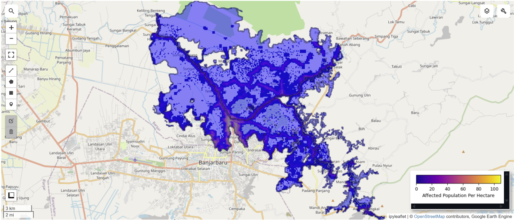<br>
       <figcaption><i>Estimasi penduduk terdampak banjir</i></figcaption>
      </a>
    </div>
  </body>
</html>

<br>

<html>
  <body>
    <div>
       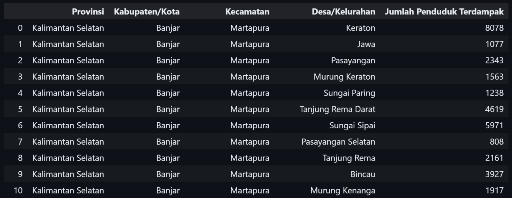<br>
       <figcaption><i>Tabel estimasi jumlah penduduk terdampak banjir untuk setiap desa/kelurahan</i></figcaption>
      </a>
    </div>
  </body>
</html>

<br>

<html>
  <body>
    <div>
       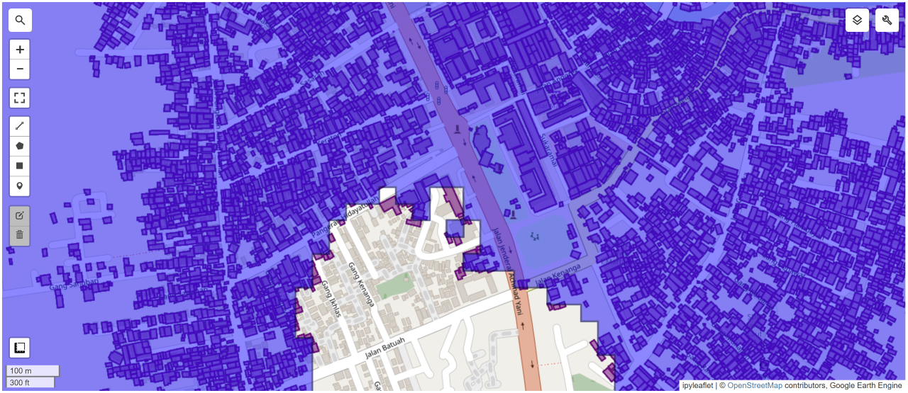<br>
       <figcaption><i>Estimasi bangunan terdampak banjir</i></figcaption>
      </a>
    </div>
  </body>
</html>

<br>

<html>
  <body>
    <div>
       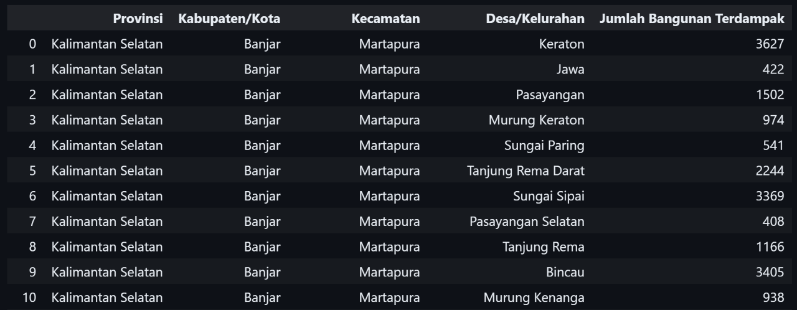<br>
       <figcaption><i>Tabel estimasi jumlah bangunan terdampak banjir untuk setiap desa/kelurahan</i></figcaption>
      </a>
    </div>
  </body>
</html>

<br>

<html>
  <body>
    <div>
       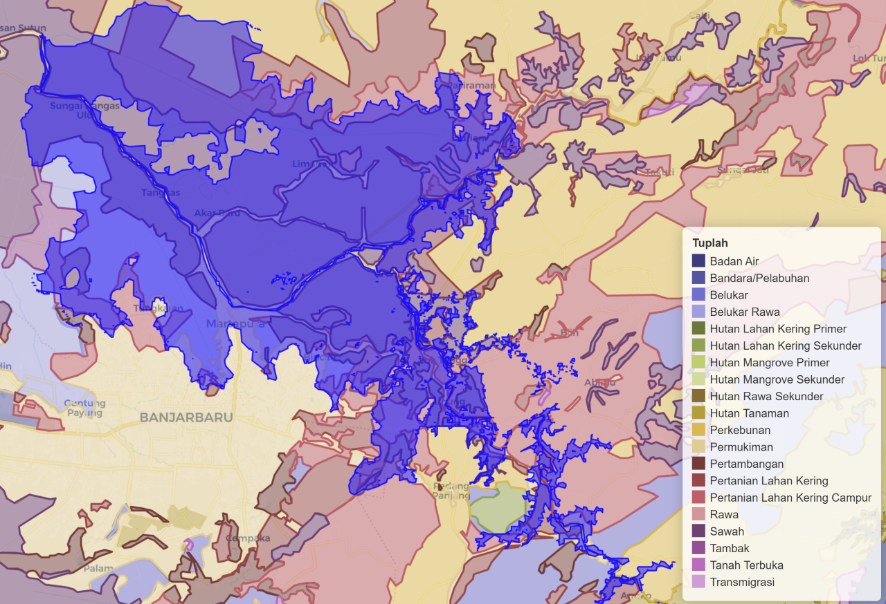<br>
       <figcaption><i>Estimasi penutupan lahan terdampak banjir</i></figcaption>
      </a>
    </div>
  </body>
</html>

<br>

<html>
  <body>
    <div>
       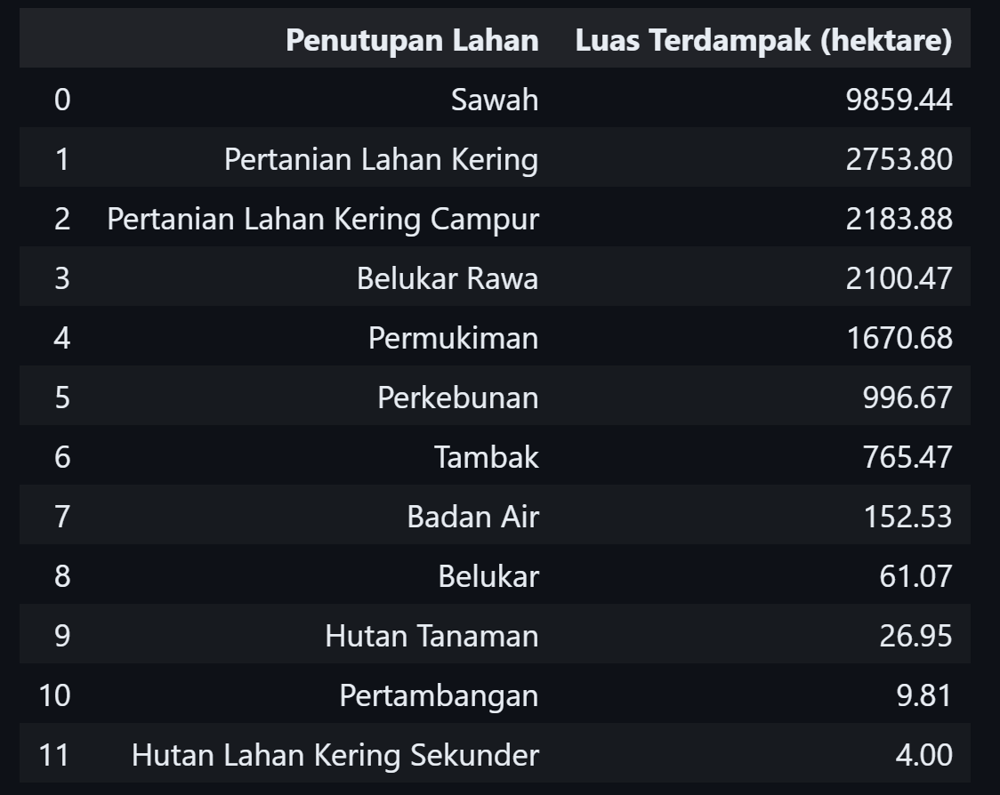<br>
       <figcaption><i>Tabel estimasi luas penutupan lahan terdampak banjir</i></figcaption>
      </a>
    </div>
  </body>
</html>

<br>

<html>
  <body>
    <div>
       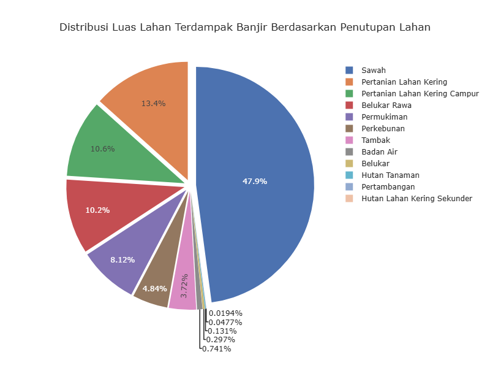<br>
       <figcaption><i>Grafik persentase penutupan lahan terdampak banjir</i></figcaption>
      </a>
    </div>
  </body>
</html>

### Persyaratan

1. Anda harus memiliki akun Google Earth Engine untuk menjalankan kode program ini.
2. Pengetahuan dasar pemrograman menggunakan Bahasa Python dan Google Earth Engine akan sangat membantu.


### Penafian

1. Kode program ini merupakan proyek eksperimental. Sehingga masih memerlukan validasi di lapangan.
2. Data CA, HAND, dan wilayah administrasi sampai level desa/kelurahan tersedia untuk seluruh wilayah Indonesia. Sehingga model dan kode program ini (hanya) dapat digunakan di seluruh Indonesia.
3. Data CA dan HAND diekstrak dari FABDEM (<a href="https://gee-community-catalog.org/projects/fabdem/">https://gee-community-catalog.org/projects/fabdem/</a>), sehingga akurasi dan ketelitian CA dan HAND sangat ditentukan oleh akurasi dan ketelitian FABDEM.
4. Data administrasi bersumber dari Badan Informasi Geospasial (BIG) di laman <a href="https://tanahair.indonesia.go.id/portal-web/">https://tanahair.indonesia.go.id/portal-web/</a>.

### Petunjuk Sitasi

1. Penggunaan HAND di dalam dokumen resmi wajib mengutip literatur ini: <a href="https://www.sciencedirect.com/science/article/abs/pii/S0022169411002599">https://www.sciencedirect.com/science/article/abs/pii/S0022169411002599</a>
2. Penggunaan FABDEM di dalam dokumen resmi wajib mengutip literatur ini: <a href="https://iopscience.iop.org/article/10.1088/1748-9326/ac4d4f">https://iopscience.iop.org/article/10.1088/1748-9326/ac4d4f</a>

### Kontribusi SDGs

<html>
  <body>
    <div class="image-container">
      
      
      
      
    </div>
  </body>
</html>
